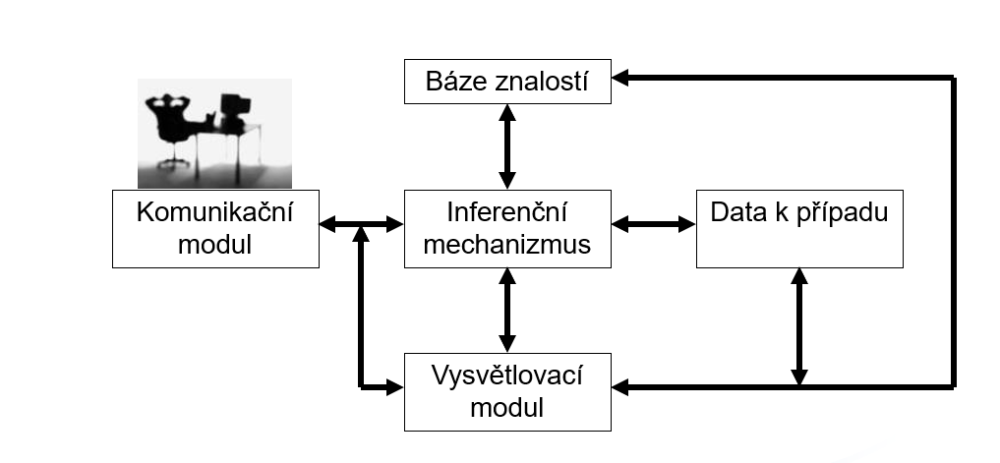

[Zpět na úvodní stránku](../README.md)

# Expertní systém
Inteligentní počítačový program, který využívá znalosti a inferenční porocedury křešení problémů, které jsou natolik obtížné, že pro své řešení vyžadují významnou lidskou expertízu  

V současné době pohled na ES jako na podpůrný systém(asystent)

## Součásti ES
- Báze znalostí - zakódované znalosti experta
- Inferenční mechanizmus - odvozovací mechanizmus (vyvozhování závěrů)
- Báze dat (ke konzultovanému případu)
- Vysvětlovací modul
- GUI

## Schéma ES

## Charekteristické rysy
- Oddělení báze znalostí od inferenčínoho mechanizmu - možnost využívat jeden IM a pracovat s různými bázemi znalostí
- Neurčitost v bázi znalostí - uloženy nejen exaktní poznatky, ale i heuristiky 
- Neurčitost v datech - Nepřesně určené hodnoty - subjektivní vliv uživatele/experta
- Dialogový režim - ES konstrouvány nejčastěji jako konzultační systémy
- Vysvětlovací činost
- Modularita a transparentnost báze znalostí - Vytváření báze znalostí probíhá laděním

## Typy úloh
- Diagnóza - Nalezení chyb
- Interpretace - Určení významu dat
- Monitorování - Sledování dat a určování okamžiků zásahu
- Plánování - Nalezení posloupnosti akcí k dosažení cíle
- Návrh - vytvíření konfigurací objektů vyhovujících daným podmínkám
- Predikce předpověd budoucích událostí

### Diagnostické úlohy
- Pevný počet cílů
- Získávání a interpretace informací potvrztení přítomnosti/nepřítomnosti závady
- Empirický cyklus stanovení diagnózy
    - formulování hypotézy
    - testování hypotézy
    - přijetí nebo zamítnutí hypotézy

#### Charakter znalostí u modelu diagnostické úlohy
- Popis Normálního chování systgému
- Popis Abnosrmální chování systému
- Výčet závad a seznam pžříznaků pro každou závadu
- Seznam příznaků pro normální situaci

#### Rozlišování znalostí
- Diagnostikování odychylky od normálu
- Diagnostikování porovnáním abnormlního chování
- Diagnostikování klasifikováním abnormality

### Generativní úlohy
- Hypotézy se generují dynamicky
- Řešení je vytvářeno z dílčích komponent
- Dnes se plínování chápe spíše jako splňování omezení, která jsou kladena na požadované řešení

## Základní čísti ES
### Báze znalostí
**Data vs znalosti** 
- Data záskány automatickým proceserm, lze objektivně verifikovat
- Znalosti získány od experta, nelze objektivně verifikovat

#### Metody reprezentace znalostí
##### Predikátová logika
Často používaná pro automatické dokazování 

Predikátová logika je odvětvím logiky, které umožňuje popisovat vztahy a vlastnosti objektů pomocí predikátů a kvantifikátorů.

##### Schémantické sítě
Popisuje realitu pomocí objektů, mezi kterými exitují vztahy

##### Rámce
V podstatě se jedná o objekty, které známe z objektového programování

##### Pravidla
nejběžnější způsob reprezentace znalostí  
Pomocí IF-THEN pravidel

### Tvrzení
Může mít podobu
- výroku - auto je červené
- Trojice (objekt, stribut, hodnota) = (auto32:barva = červená)

### Atributy mohou být
kategoriální(binární, nominální, ordinální)
Numerické

**Pravidla v bázi znalostí se mohou znázornit AND/OR grafem** - uzly grafu představují výroky a orientace hran pravidla

**V pravidlech rozlišujeme tři typ tvrtzení (uzlů)**
- Dotazy - pouze v předpokladech
- cíle - pouze v závěrech
- Mezilehlá tvrzení - v přepokladech i závěrech

### Tvorba aplikace
- Míra složitosti
- Míra neurčitosti

**Nízký stupeň složitosti i neurčitosti -> konvenční metody**  
**Vysoký stupeň složitosti i neurčitosti -> nezvládnutelné pomocí ES**  
**Ostatní případy jsou vhodné pro ES**

### Tvorba ES
- časově, finančně a personálně náročné

#### Důvody pro nasazení ES
- předání znalostí
- standardizace způsobu rozhodování

#### Fáze
- Analýza - posuzování problému
- Specifikace - definování činnosti ES
- Vývoj - iterativní proces, zpřesnování báze znalostí, rozšiřování záběru ES
- Vužívání - dalščí aktualizování a opravování ES

## Získávání znalsotí
Získávání znalostí experta je nejkritištějším místem tvorby ES  
Znalostní inženýr - odborník na tvorbu ES, který spolupracuje s expertem při vytváření ES

### Proces získávání znalsotí
- Verbální techniky - slovní dialog
- Nonverbální techniky - tabulky, schémata

#### Faktory ovlivnující proces získávání znalostí
- Obava experta ze ztráty výsadního postavení špičkového experta

#### Práce s expertem
- Zasvěcení do problému tvorby ES, požadavků, očekávání

##### Verbální techniky
- Formální znalsot ve slovní podobě

##### Techniky založené na rozhovoru
- Přednáška  
- Nestrukturovaný cílený rozhovor  
- Strukturovaný rozhovor

##### Způsoby vedení rozhovoru s více experty 
- Forma skupinové diskuze
- Brainstorming

##### Techniky založené na pozorování
- Komentovaný případ
- Prosté pozorování

**Metoda repertoárové tabulku**
Jedná se o techniku používanou především v oblasti psychologie a managementu pro získání a strukturování informací o osobních postojích, hodnotách a vnímání jednotlivců.

**Maticová analýza**
Opět se využívá dvourozměrná tabulka, kde jeden rozměr tvoří objekty a druhý vlastnosti

**Více rozměrné škálování** vytvoření tabulky vzájemných podobností věech objektů

**Žebříčková analýza**
Vzestupné kroky - hledání spoleščné nadtřídy dvou nebo více pojmů  
Sestupné kroky - heldání podtříd nebo příkladů určitého pojmu
