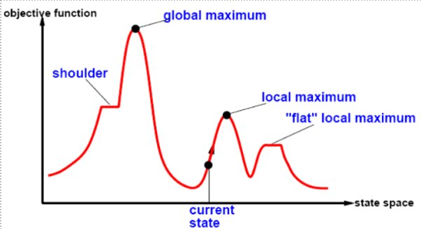

[Zpět na úvodní stránku](../README.md)

## 1. Lokální prohledávání
Vhodné, když nás nezajímá cesta, důležité je nalézt cíl (8. královen)

pracuje s jedním stavem(konstantní pamět) - v každém kroku tento stav "trochu změní" - nepamatuje si prošlou cestu

### Základní pojmy

**Rameno:** používá k označení cesty, kterou algoritmus sleduje při prohledávání stavového prostoru.

**Globální maximum:** Globalní maximum je stav ve stavovém prostoru, který má nejvyšší hodnotu cílové funkce ze všech stavů.

**Lokální maximum:** Lokální maximum je stav, ve kterém žádný sousední stav nemá lepší hodnotu cílové funkce. Algoritmus může být náchylný zůstat uvězněný v lokálním maximu, což může bránit dosažení globálního maxima.

**"Ploché" Lokální Maximum:** označuje situaci, kdy okolní stavy mají podobně hodnoty cílové funkce, což může ztížit rozhodování o nejlepším směru pro pohyb. Tento jev může být výzvou pro algoritmus lokálního prohledávání, který se snaží najít optimální řešení.

### Horolezecká metoda
Z okolí daného stavu vždy vybereme stav, který má nejlepší objektivní funkci a do tohoto stavu přejdeme(vidí pouze okolí daného stavu, předchozí stav ihned zapomíná)

#### Vlastnosti HC
Jesná se o hladový algoritmus - jde za nejlepším sousedem bez pohledu dále dopředu
- nedokáže uniknout z lokálního optima/maxima
- hřeberny(posloupnosti lokálních optim) velmi obtížníé pro hladové algoritmy

#### Varianty HC
**Stochastixký HC**: mezi zlepšujícími sousedy vybírá náhodně s pravděpodobností danou velikostí zlepšení
nemusí se vydat do nejlepšího souseda 

**HC první volby** náhodně generuje sousedy dokud nenajde lepší stav a do něj se vydá

**HC s náhodnýmy restarty** ocitne-li se v lokální optimu, začne prohledávat znova z náhodného stavu (umožňuje únik z lokálniho optima)

### Parsky
Lokální prohledávání má extrémně nízké požadavky na pamět

#### Algoritmus lokálních paprsků
Algoritmus začne s `k` náhodnými stavy.Vždy najde všechny jejich sousedy. Pokud najde konečný stav, končí, jinak vybere `k` nejlepších stavů pro další zkoumání. Tento přístup se podobá přirozenému výběru, kdy lepší varianty mají vyšší šanci být vybrány, ale lze také použít náhodný výběr.

#### Simulované žíhání
**HC** se nikdy nevydává dolů - není schopna překonat lokálno optimum  
**Náhodná procházka** která vybírá stav z okolí zcela náhodně, je úplná ale pomalá  
**Simulované žíhání** kombinuje výhody obou metod algoritmus náhodně volí stav z okolí, do které se vydá pokud: 
- je lepší než aktuální stav
- je horší než aktuální stav, ale zhoršení je povoleno s určitou mírou pravděpodobnosti

### Genetické algoritmy
Stochastické prohledávání s paprsky kombinuje dva stavy pomocí sexuální reprodukce. Začínáme s \(k\) náhodnými stavy (populací), kde každý stav je reprezentován řetězcem symbolů v konečné abecedě, například jako DNA. Kvalita stavů je určena fitness funkcí, která slouží jako objektivní měřítko. Následně jsou vybrány dvojice stavů pro reprodukci podle jejich fitness, a pro každý pár se provede crossover, který kombinuje jejich řetězce, následně se aplikuje mutace na nový stav s malou pravděpodobností změny symbolu.

