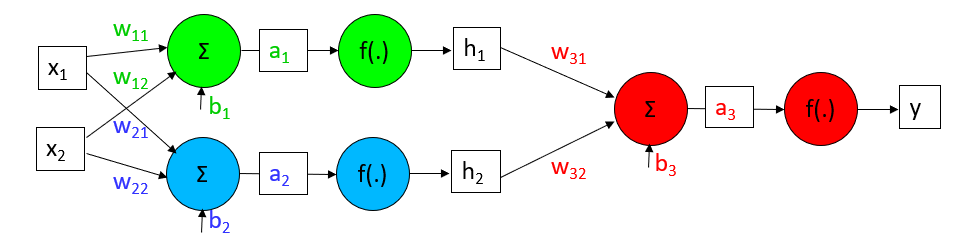
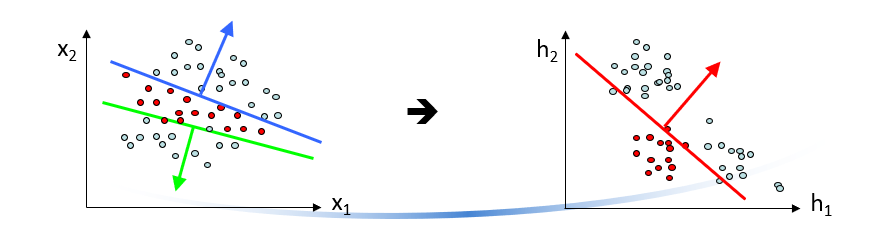

[Zpět na úvodní stránku](../README.md)

# Neuronové sítě
Insporovány poznatky o neuronech a nervových sítích živých oraganizmů  
Schopnost extrahovat a reprezentovat závislosti v datech, které nejsou zřejmé  
Schopnost učit se

## Umělá neuronová síť
Umělá neuronová síť ej distribuovaný výpočetní systém sestávající z dílčích podsystémů, který je insporován neurofyziologickými poznatky o struktuře a činnosti neuronů a nervových systémů živých oranizmů, a který je ve větší či menší míře realizuje  
Každý neron tranformuje své vstupy na výstup - síla je v kombinaci neuronů

### Model neuronu
Obsahuje několik vstupů, které jsou ohodnoceny vahami a jeden výstup  
V neuronu probíhají dva procesy:  
- výpočet potenciálu
- výpočet hodnoty výstupu pomocí aktivační funkce, nejčastěji sigmoidy

#### Aktivační funkce 
Logická sigmoida

####  Perceptron 
je jednoduchý model umělé neuronové sítě, který byl poprvé navržen v 50. letech 20. století Frankem Rosenblattem. Jedná se o základní stavební blok neuronových sítí a slouží k binární klasifikaci. Perceptron má vstupy, váhy, sumační funkci, aktivační funkci a výstup.

**Učení perceptronu**: Učení perceptronu probíhá na základě korekcí váh, aby dosáhl správných výstupů pro daný vstup. Tento proces se nazývá učení s učitelem, kde každý vstup je přiřazen k předem známému výstupu (označenému výstupu).

#### Algoritmus výpočtu
**Inicializace úvodních hodnot** - nastavení vah na náhodné hodnoty, nastavení prahu

**Předložení vstupního vektoru síti** - vstupní vektor je předložen síti

### Linerání klasifikátory
Nevýhoda: pouze lineátní rozhodovací hranice  
Možné řešení:
- POužít jiný než lineární klasifikátor
- Nelineární trandformace vstupních vektorů

#### Hierarchie lineárních klasifikétorů
Napřed natrénujeme modrý a zelený klasifikátor tak aby oddělily každý cluster modrých dat od zbytku
Pak natrénujeme červený klasifikátor na pravděpodobnostních výstupech modrého a zeleného klasifikátoru  

## Neuronové sítě pro klasifikace
Takovýto hirerchický klasifikátor můžeme trénovat jako celek bez nutnosti přechotí supervize.  
  
Klasifikátory v první vrstvě
- se mají samy naučit jakéí clustery je v datech třeva identifikovat, aby finální lineární klasifikátor mohl oddělit třídy.
- lze vidět jako nelineární transformaci do prostoru, kde jsou třády dobře lineárně separovatelné
- představujé tzv. skrytou vrstvu

**Struktura sítě** pro větší výpočetní sílu se neurony uspořádávají do sítí neuronů

### Typy neuronových sítí
Existuje celá řada typů neuronových sítí  
- více vrstvá perceptonová síť
- hopfieldová síť
Základními úlohami neuronových sítí jsou klasifikace aregrese  
Podle přítomnosti učiteel můžeme neuronové sítě dělit na sítě s učitelem a bez učitele

### Proces učení neuronových sítí
Pro učení je třeba mít dostatek reprezentativních příkladů  
Trénovací, validační, testovací množina  
Na začátku učení bývají výhy nejčastěji nastaveny na náhodná čísla  
Proces učení se snaží minimalitovat odchylku mezi skutečným a požadovaným výstupem  
Kažedá neuronová sít má jiný aůgoritmus učení, vesměs jsou to ale iterační procesy

### Návrh neuronové sítě
Pro řešení každéí úlohy musí být navržen jedinečná neuronová sít
Problém over-sizing, over-learning

### Příprava dat
Standardní formát datové množiny

### Nezapomenout na normalizaci
Normalizace často znamená převod hodnot tak, aby spadaly do stejného rozsahu, často mezi 0 a 1.

### Více vrstvá percepronová síť
- Nejrozšířenější a nejpoužívanější síť
- Jak pro klasifikaci tak pro regresi (a tedy i predikci časových řad)
- Síť s učitelem
- Aktivační funkcí je nejčastěji sigmoida
Otázka výběru počtu vrstev a počtu neuronů

**Nevýhody** obtížné řešení problému lokálních minim a poměrně dlouhá doba učení

#### Více vrstvá dopředná neuronová síť
Počet vrstev je větší než 3
Je dokázáno, že stačí macimálně 2 skryté vrstvy pro jakoukoliv hranici 

Aktivační funkce RELu nebo GELu u výstupní vrstvy sigmoida

Libovoulnou spojitou, funkci lze zapsat s pomocí do sebe vnořených funkcí jediné proměnné

**Metody zlepšující chování sítě**
- velikost parametru učení
- Moment, šum 
- Přidání neuronů

### Backpropagation - učení
Backpropagation (zpětná propagace) je metoda učení v neuronových sítích, která se používá k optimalizaci váh spojení mezi neurony. Jednoduše řečeno, backpropagation slouží k úpravě váh v síti tak, aby minimalizovala rozdíl mezi předpovězenými a skutečnými hodnotami výstupu sítě.  
Backpropagation umožňuje neuronovým sítím adaptovat se k trénovacím datům a naučit se reprezentovat složité vzory ve vstupech.

## Trénéování neuronové sítě
Uvažujeme jednoduchý případ binárního klasifikátoru. Jako objektivní funkci pravděpodobnost správných anotací  

### Zpětně šíření chyby
Zpětné šíření chyby (Backpropagation) je algoritmus učení v neuronových sítích, který slouží k optimalizaci vah mezi vrstvami sítě na základě chyby výstupu. Pro výpočet gradientu chyby, což je klíčový krok pro úpravu vah, se využívá řetězového pravidla.

### Úprava vah
1. po předložení všech vektroů trénovací sady
- pomalejší konvergence, nebezpečí uvíznutí v lokálním minimu

2. Po každém vektoru
- rychlejší postup trénování při redundantních trénovacích datech
- riziko přetrénovaní na poseldndích pár vektorů z trénovací sady
3. Po předložení nškolika vektorů

### Zpětné šíření s momentem
Intuitivní přestava
- kulička pohybující se po povrchu chbyové funkce - lokaci prezentuje velikost vah
- Kulička má ke gradientu ještě rychlost a gradient pouze způsobuje zatáčení

### Vylepšení momentů
Standartní moment prvně vypočítá gradient a pak udělá skok  
Vylepšení
- prvně se udělá velký skok
- Pak se změří gradient, kde se skončilo a udělá se korekce

**Adam** Adam (Adaptive Moment Estimation) je optimalizační algoritmus, který se často používá pro aktualizaci vah v neuronových sítích během procesu trénování. Byl navržen k tomu, aby kombinoval výhody dvou jiných optimalizačních algoritmů: momentu a RMSprop

### Ochrana proti přetrénování
Rozdělení dat: trénovací, validační, testovací  
Dále, dejte modelu vědět, že nemusí všechno pamatovat do nejmenšího detailu. Volte jednodušší modely a používejte triky, které mu říkají, aby si držel váhy pod kontrolou, jako třeba "pravidelnost".

# Varianty neuronových síťí
Umělé neuronové sítě mohou mít více než jednu skrytou vrstvu:

Neuronovou síť lze použít pro jiné problémy než binární klasifikace - Regrese

Klasifikace do více tříd:

## Dopředná klasifikační neuronová síť pro více tříd
Dopředná klasifikační neuronová síť pro více tříd je typ neuronové sítě navržený pro úlohy klasifikace, kde je cílem přiřadit vstupní data do jedné ze tříd. Jedná se o konkrétní architekturu neuronové sítě, která pracuje ve směru od vstupu k výstupu, tedy dopředu.

## Rekurentní neuronová síť
Rekurentní neuronová síť (RNN) je typ neuronové sítě, který se vyznačuje tím, že obsahuje zpětné spojení, což umožňuje informacím "proudit" přes čas. To znamená, že RNN mohou lépe pracovat s sekvencemi dat, jako jsou časové řady nebo jazyková data, kde kontext a historie jsou důležité.

### Zpětná propagace časem
Pro trénování můžeme rekurentní sít rozvinout v čase a trénovat ji strjnš jako doprednou neuronovu sit

## Konvoluční neuronové sítě
CNN je obvyklá architektura pro rozpoznávání obrázků  
Berou v úvahu to jak jednotlive vstupy neuronové sítě (pixely obrázku) leží vedle sebe.  
Sdílení vah pro různé pozice v obrázku  invariance vůči translaci obrázku.

### Konvoluční filtry
Konvuluční vrstva aplikuje několik konvolučních filtru jejich váhy se v rámci trénování CNN učíme  
Výsledkem je několik hladin obrázku

### Pooling
Pooling vrstva provede podvzorkování obrázku
Např Max-pooling nahradí každou čtverici pizeků pouze jejich maximalní hodnotou  zredukuje onrázek na poloviční velikost

### Kompletní CNN
CNN střídá konvolučni a pooling vrstvy  
Na konci se většinou objevi obvyklá plně propojená hladina  
Konvoluční filtry v pozdějších vrstvách mají tvar 3D matic tak aby operovaly nad všemi “feature maps”. Filtry se ale pohybuji jen ve dvou dimenzich:

### AlexNet
1000 skupin  
První "funkční“ konvoluční síť

### U-net
U-NET – navrhnuta 2015 pro segmentaci  biomedicínských obrazů (snímky z mikroskopu) – populární,ale překonaná (existuje i 3D U-net, U2-net a další vylepšení)

### DeepLabv3+
2020 – nejlepší pro segmentaci obrázků

### PointNet
Příklad segmentace 3D bodů v prostoru

### Zpracování textu
Word2Vec (encoder) 
- Převod jednotlivých slov tokenu na vektory

GPT
- Generování textu

#### ChatGPT
Vstup (Inputs): Posloupnost tokenů  
Positional encodig: Přidává vektor, který definuje pozici tokenu ve větě  
Dopředná síť (feed forward): plně propojené vrstevy a aktivačních funkcí

### Triky v neuronových sítí 
- předučení
- Augmentace dat - ototčení, posunutí

